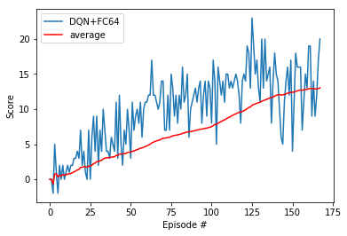

# Navigation with Deep Reinforcement Learning

Deep Reinforcement Learning (DRL) is a recent technique for providing to an agent with a policy that solves a task. In this work I have implemented a DRL scheme so that an agent can learn to navigate into an environment where there are yellow and black bananas. Yellow bananas provide a positive reward to the agent while black ones provide a negative reward. The agent's objetive is to collect as many as possible yellow bananas. 

The implemented approach is based on the work proposed by ??. where the action-value table is approximated by a neural network. 

## The Environment

The state that receives the agent is a tuple of  37 elements. The available actions are four move forwads, backwars, turn left and turn right.

## Neural Network

I have implemented the following network as the deep-Q-network. It has four layers. The imput layer (L1) has 37 nodes to introduce the agent state, then the second (L2) and third (L3) layers have 64 nodes. The fourth (L 4) and final layer has 4 elements, in order to provide the value for each action.

## Training

The traning was run for 175 episodes until the agent gets an average of 13 points.

